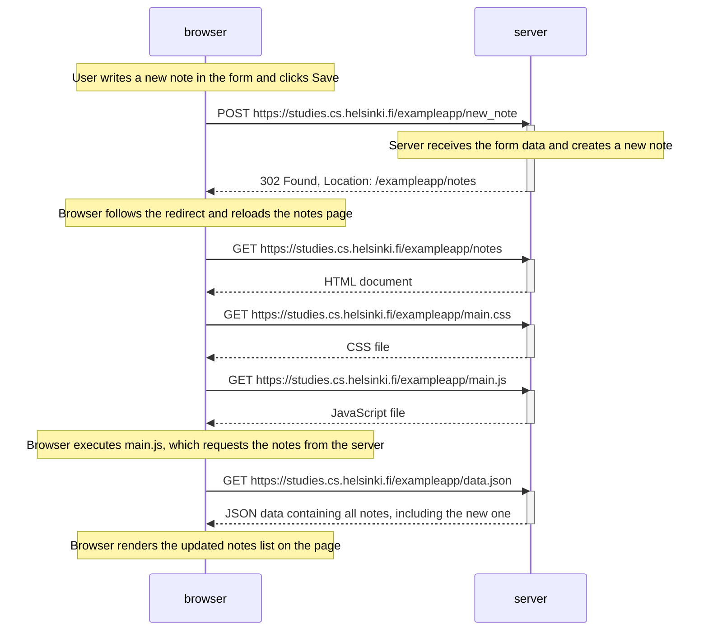

# 0.4 New note

```mermaid
sequenceDiagram
    participant browser
    participant server

    Note over browser: User writes a new note in the form and clicks Save

    browser->>server: POST https://studies.cs.helsinki.fi/exampleapp/new_note
    activate server
    Note over server: Server receives the form data and creates a new note
    server-->>browser: 302 Found, Location: /exampleapp/notes
    deactivate server

    Note over browser: Browser follows the redirect and reloads the notes page

    browser->>server: GET https://studies.cs.helsinki.fi/exampleapp/notes
    activate server
    server-->>browser: HTML document
    deactivate server

    browser->>server: GET https://studies.cs.helsinki.fi/exampleapp/main.css
    activate server
    server-->>browser: CSS file
    deactivate server

    browser->>server: GET https://studies.cs.helsinki.fi/exampleapp/main.js
    activate server
    server-->>browser: JavaScript file
    deactivate server

    Note over browser: Browser executes main.js, which requests the notes from the server

    browser->>server: GET https://studies.cs.helsinki.fi/exampleapp/data.json
    activate server
    server-->>browser: JSON data containing all notes, including the new one
    deactivate server

    Note over browser: Browser renders the updated notes list on the page
```
